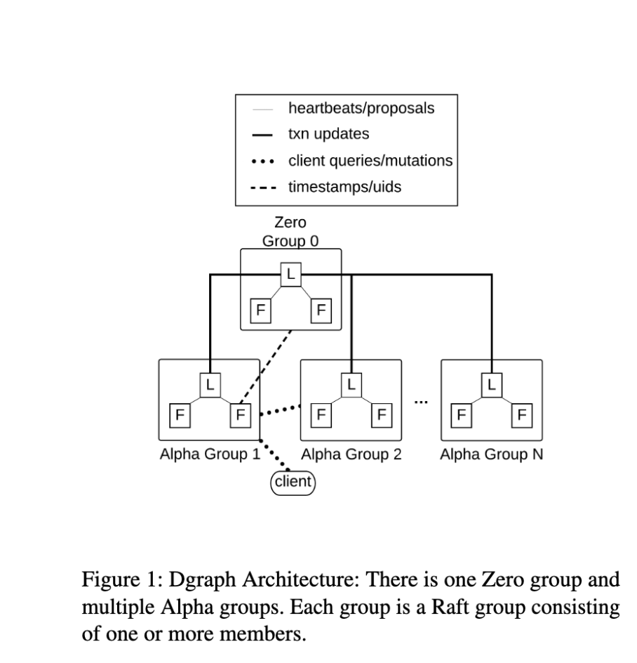
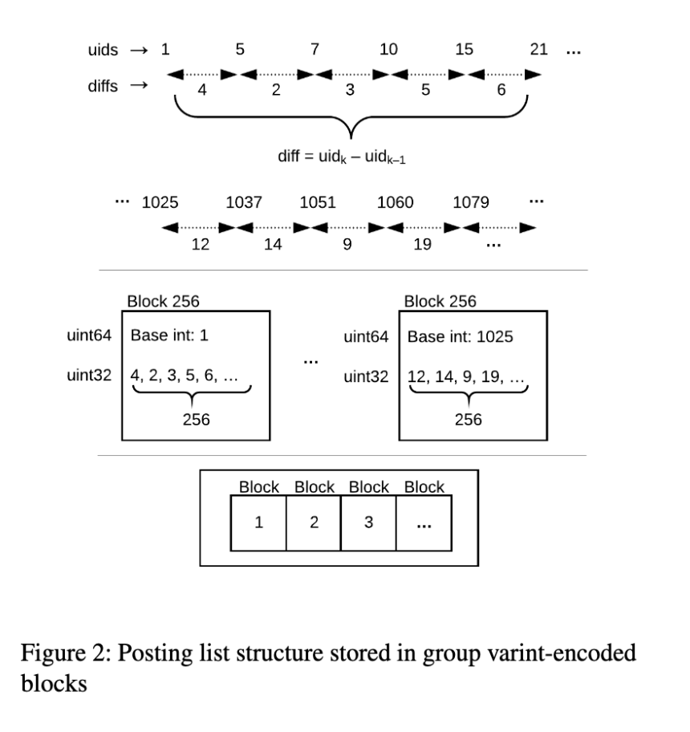
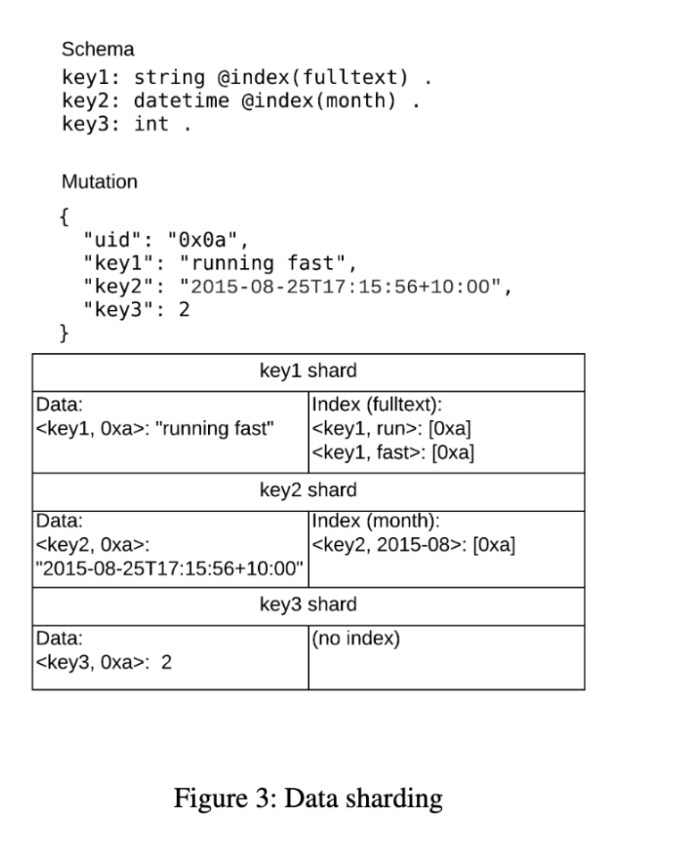

# Reference
https://github.com/dgraph-io/dgraph/blob/master/paper/dgraph.pdf
# Dgraph Database
- Synchronously replicated
- Transactional
- Distributed Graph database
- Provides horizontal scaling
- Provides low latency arbitrary depth joins in a constant number of network calls that would be required to execute a single join
# Introduction
## Existing problem
- Distributed system/database tend to suffer from join depth problem
- I.e. number of traversal of relationship increases within a query, the number of network calls required increase.
- This is typically due to entity based data sharding where entities are normally randomly distributed across servers containing all the relationship and attributed along them. 
- This approach suffers from high fanout result set in intermediate steps of a graph query causing them to do a broadcast across the cluster to perform joins on the entities. 
## DGraph Approach
- DGraph is a distributed database with native Graph backend.
- DGraph automatically shards data into machines, as the amount of the data or the number of servers changes.
- It also supports synchronous replication backed by Raft protocol, which allow query to seamlessly failover to provide high availability. 
- DGraph solves joins depth problem with a unique sharding mechanism. 
- Instead of sharding by entity, shards by relationships. 
- DGraph's unique way of sharding data is inspired by research at Google, which shows that the overall latency of query is greater than the latency of slowest component.
- The more servers a query touch to execute the slower the query latency would be.
- By doing relationship based sharding, DGraph can execute a join or traversal, in a single network call. 
- DGraph executes arbiterary depth joins without network broadcast, or collecting data at central place. 
- This allow queries to be fast and latency to be low and predictable.

# DGraph Architecture
- DGraph consists of Zeros and Alphas, each representing a group they are serving
- Each group forms a Raft cluster of 1, 3 or 5 members as per configurations
- All updates made to the group are serialize via Raft consensus algorithm applied in that order to the leader and followers
- Zeros stores and propagate metadata about the cluster whiles Alphas store user data
- Zeros are responsible for membership information, which keeps track of group each Alpha is serving, its internal IP address for communication within the cluster, the shards it serving etc
- Zero do not keep track of the health of the Alpha and take action on them, this is the consider job of operator
- Using this information, Zero can tell the new Alpha to either join and serve existing group or from a new group
- The membership information is streamed out of Zero to all the Alpha.
- Alpha can use this information route queries or mutation which hit the cluster
- Every instance in cluster forms a connection with every other instance i.e. forming 2 * (N C 2) open connection, where N = number of DGraph instances in the cluster
- Usage of these connection depends on the relationship

- Every open connection does have light weight health checks to avoid stalling on a target server which has become unresponsive
- Both Alpha and Zeros expose one port for intra cluster communications over gRPC
- and one for external communication over HTTP
- All official clients runs over gRPC
- Zero also runs oracle, which hands out monotonically increasing logical timestamp for transaction in cluster (no relationship to system time)
- A Zero leader would typically lease out a bandwidth of timestamp upfront via Raft, and then service timestamp request strictly from memory without any further coordination
- Zero gets information about size of data from each Alpha leader

# Data Format
- DGraph can input data in JSON RDF NQuad format
- When parsing RDF/JSON, data is directly converted into an internal protocol buffer data format and not interchanged among two
```
{
    "uid": "0x1",
    "type": "Astronaut",
    "name": "Mark Watney",
    "birth": " 2005/1/11",
    "followers": [{"uid": "0x2"}, {"uid": "0x3"}]
}

<0x1> <type> "Astronaut" .
<0x1> <name> "Mark Watney" .
<0x1> <birth> "005/1/11" .
<0x1> <followers> "0x2" .
<0x1> <followers> "0x3" .
```
- A triplet is typically expressed as subject predicate object or subject predicate value
- Subject is a node, predicate is a relationship, and object can be another node or primitive data type.
- DGraph makes no difference on how to handle these two types of records
- DGraph considers this as unit of record and a typical JSON map would be broken into multiple such record
- Data can be retrieved from DGraph using GraphQL
# Data Storage
- DGraph stores data in an embeddable key-value database called Badger for data input output on disk
- `Badger is a LSM tree based design, but differs from others in how it can optionally stores value separated from keys to generate a much smaller LSM tree, which results in both lower write and read amplifications`
- It provides equivalent read latencies compared to B+ tree (which tend to provides faster than LSM tree)
- `All records with same predicate form one shard`
- Within a shard, records sharing the same subject-predicate are grouped and condensed into one single key-value pair in `Badger`
- This value is referred as `posting list`, a terminology commonly used in search engine to refer to a sorted list of doc ids containing a search term
- A posting list is stored as value  in `Badger` with the key being derived from subject/predicate
```
<0x1> <follower> <0xa> .
<0x1> <follower> <0xb> .
<0x1> <follower> <0xc> .
<0x1> <follower> <0xd> .

key = <follower, 0x1>
value = <0xa, 0xb, 0xc, 0xd>
```
- All subjects in DGraph is assigned a globally unique id called `uid`
- A `uid` is stored as `64 bit` unsigned integer (unit64), native treatment by `Go` language in the code base
- Zero is responsible for handling out `uids` as needed by Alpha and does it in the same monotonically increasing fashion as timestamp 
- A uid once allocated is never reallocated or reassigned
- Thus every node in Graph can be represented by unique integer number
- Object values are stored in posting
- Each posting has an integer id
- When the posting holds the an object, the id is the `uid` assigned to that object
- When posting holds a value, the integer id for value is determined based on schema of the predicate.
- If predicate allows multiple values, the integer id of the value would be the finger print of the value.
- If the predicate stores values with language, the integer id would be a finger print of language tag
- Otherwise the integer id would be set to maximum possible unit64
- both `uid` and integer id never set to `0`
- Value could be one of the supported data types; int, float, string, datetime, geo etc
- The data is converted into binary format and stored into a posting along with information about original type
- A posting can hold facets
- Facets are key/value labels on an edge, treated like attachment
- In a common case, where the predicate only has objects, a posting list will consist of sorted uids
- These are optimized by doing integer compression
- The uids are grouped in block of 256 integers, where each block has uids, and a binary blobs
- The blob is generated by taking a difference of current `uid` with the last and storing the difference in bytes encoded using group variant
- This generates a data compression ration of 10
- When do intersection, we can use these data blocks do binary searches or block jumps to avoid decoding all blocks.
- Sorted integer encoding is hotly researched topic

- Due to these technologies, a single edge traversal corresponds to only a single `Badger` lookup
- For example, finding list of all `X` followers, would involves doing a lookup on `<follower, X>` key which would give a posting list containing all of their followers `uids`
- Further lookup can be made to get the list of posts made by their followers
- Common followers, between `X` and `Y`, can be found by doing two lookups followed by intersecting the sorted int list of `<follower, X>` and `<follower, Y>`.
- Note that distributed join and traversal only requires `uids` to be transmitted over network, which is also very efficient.
- All this allows DGraph, to be very efficient on these operations, without compromising on the typical `SELECT * FROM TABLE WHERE X=Y` style record lookup
- This type of data storage has benefits on join and traversal 
- But comes with additional problem with high fanout 
- If there are too many records with same `<subject, predicate>`, the overall posting list could grow in untenable size
- This is typically only a problem with objects 
- DGraph solves this by binary splitting posting list as soon as its on-disk size hits a certain threshold
- A split posting list would be stored as multiple keys in `Badger` with optimization made to avoid retrieving the splits until operation needs them.
- Despite storage difference, posting list continues to provides the same sorted iteration via APIs as an unsplit list
# Data Sharding
- DGraph shares lot of common feature between NoSQL and distributed SQL database
- But it is different in how it handles its records
- In other database, a row or document would be the smallest unit of storage (guaranteed to be located together)
- While sharing could be as simple as generating equal sized chunks consisting of many of these records
- DGraph's smallest unit of record is `triplet`
- With each predicate in its entirely forming a shard
- DGraph logically groups all the triplets with same predicate and consider them one shard
- Each shard is then assigned a group (1 to N)
- Which can then be served by all the Alphas serving that group
- This data sharding models allows Dgraph to executes a complete join in a single network call and without any data fetching across servers by ther caller
- This combined with grouping of records in a unique way on disk to convert operation which would typically be executed by expensive disk iterations into fewer, cheaper disk seeks makes DGraph internal working quite efficient 
- Following is sample of data about people where they lives
```
<person-a> <lives-in> <sf> .
<person-a> <eats> <sushi> .
<person-a> <eats> <indian> .
....
<person-b> <lives-in> <nj> .
<person-b> <eats> <thai> .
<person-b> <eats> <italian> .
```
- In this case, it will have two shards, `lives-in` and `eats`. 
- Assuming that worst case scenario, where is the cluster is so big that each shards lives on separate server.
- For a query which asks for `[people who lives in SF eat Sushi]` 
- Dgraph would execute one network call to server containing `lives-in` and do a single lookup for all people who lives in `SF` (`* <lives-in> SF .`) 
- In the second step, it would take those result and send them over to server containing `eats` do a single lookup to get all the people who eats `Sushi` (`< * <eats> Sushi .>`)
- And then intersects with previous step's resultset to generate the final list of people from SF who eats Sushi
-  



# Data Rebalancing
- Each shards contains whole predicate in its entirty which means Dgraph shards cane be of uneven size
- The shard not only contain the original data, but also all of their indices
- Dgraph groups contains many shards so that group can also be uneven size
- The groups and shard size are periodically communicated to zero
- Zero uses this information to try to achieve a balance among group, using heuristics
- Current one being used is just data size, with the idea that with equal size group would allow similar resource usage across servers serving those groups.
- Other heuristics for eg around query traffic can be added latter
- To achieve balance, Zero would moves shards from one group to other group.
- It does so by marking the shard read only, then asking the source group to iterate over the underlying key value concurrently and streaming them over to the leader of the destination group
- The destination group leader proposes these key value through Raft, gaining all the correctness that comes with.
- Once all the proposal have been successfully applied by the destination group, Zero would mark the shard as being served by the destination group
- Zero would then tell source group to delete the shard from its storage, thus finalizing hte process

There are some race and edge conditions which can cause transactional correctness to be violate
1. Violation can occur when a slighlty behind Alpha server would think that it is still serving the shard (despite that shard is moved to other server) and allow mutation to be run on itself. To avoid this, all transaction state keep the shard and the group info for writes. The shard group info is then checked by Zero to ensure that the transaction observes and what Zero has is the same. A mismatch would caused transaction abort
2. Another violation happens when a transaction commits after the shard was put into read only mode. This would cause that commit to be ignored during shard transfer. Zero catches this by assigning a timestamp to move operation. Any commits at higher timestamp would be aborted, until the shards move has completed, and the shard is brought back to read-write mode.
3. Yet another violation can occur, when the desination group recives a read below the move timestamp or a source group receives a read after it has deleted the shard. In both cases, not data has exist which can cause read to return invalid nil. DGraph avoids this by informing the destination group of move timestamp. Which it can use to reject any read for that below it.

# Indexing
DGraph is designed to be a primary database for application. As such, it supports, most of the commonly needs indices. In particular, for string it supports following
- Regular expression
- full-text search
- term matching
- exact and hash matching
For `Datetime` it supports following
- year
- month
- day 
- hour
All these indices are stored by `DGraph` using same posting list format descibed before. The difference between index and data is key. A is typically following
```
<predicate, uid>
```
while an index is below
```
<predicate, token>
```
A token is derived from the value of the data, using an index tokenizer. Each index tokenizer supports following
```
type Tokenizer interface {
    Name() string
    // Type returns the string representation of the typeID that we care about
    Type() string
    // Tokens return tokens for given value. the token shouldn't be encoded with the byte identifier
    Tokens(interface{}) ([] string, error)
    // identifier returns the prefix byte for this token type. This should be unique. The range 0x80 to 0xff (inclusive) is reserved for user provided custom tokenizers
    Identifier () byte
    // isSortable returns true if tokenizer can be used for sorting/ordering
    IsSortable() bool
    // Is lossy, returns true if we don't store the value directly as index keys during tokenization. If a predicate is tokenized using a loosy tokenizer we need to fetch the actual value and compare.
    IsLossy() bool
    }
```
- Every tokenizer has a globally unique identifier (`Identifier byte[]`), including custom tokenizers provided by operator
- The tokens generated by prefixed with a tokenizer identifier to be able to traverse through all tokens belonging to only that tokenizer
- This is useful when doing iteration, for inequality queries ( greater than, less than etc)
- Inequality queries can only be done, if a tokenizer is sortable. For example, for string, an exact index is sortable but has index is not
- Depending on which index a predicate has set in schema, every mutation in that predicate, would invoke one of more of these tokenizer, to generate the tokens.
- Indices, only operates on value, not objects
- A set of tokens would be generated with the before mutation value and another set of with after mutation. Mutation would be added to delete the subject `uid` from the posting lists of before tokens and to add the subject `uid` to the after tokens.
- All indices have object values, so they largely deal with only `uids` 
- Indices in particular, can suffers from high fan out problem an are solved using posting list splits.
# Multiple Version Concurrency Control
- Data is stored in posting list format which consists of posting sorted by integer id
- All posting list writes are stored as deltas to `Badger` on commit, using a commit timestamp
- It is not possible to update this list in place for multiple reasons
- One is that `Badger` (And most LSM tree), writes are immutable, which plays very well with file systems and rsync
- Second is that, adding an entry within a sorted list requires moving following entries, which depending upon the position of entry can be expensive.
- Third, as the posting list grows, we want to avoid rewriting a large value every time a mutation happens (for indices, it can happen quite frequently)
- Dgraph considers posting list as an state
- Every future writes, is then stored as a delta with a higher timestamp
- A delta would typically consists of posting with an operation (set or delete)
- To generate a posting list, `Badger` would iterate the versions in descending order, starting from the read timestamp, picking all details until it finds the latest state.
- To run a posting list iteration, the right posting for a transaction would be picked, sorted by integer id, then merge sort operation is run between these delta postings, and the underlying posting list state.
## Rollups
As keys get read, DGraph would selectively regenerate the posting lists which have a minimum number of delta or haven't been generated for a while.
# Transactions
- DGraph has goal to not to depends upon any third party system. 
- This proved quite hard to achieve while providing high availability for not only data but also transactions.
- While designing Transactions in DGraph, team looked into papers from Spanner, HBase, Precolator and others. 
- Spanner most famously uses atomic clocks to assigns timestamps to transactions. This comes at the cost of lower write throughput on commodity servers which don't have GPS based time synchronization system
- So team choose single Zero server based approach 
- To avoid Zero as single point of failure, it runs as cluster using RAFT
- But his comes as challenge of how to handover in case of leader relection
- Omid, reloaded paper handles this problem by utilizing external system

Since none of the existing soln was simple therefore team built its own transaction system as defined below
## Lock free High availability Transaction processing
- DGraph follows a lock free transaction model
- Each transaction pursues its course concurrently, never blocking on other transaction, while reading committed data at or below its start timestamp
- Zero leader maintains an Oracle which hands out logical transaction timestamp to Alphas
- Oracle also keeps track of a commit map, storing a conflict key -> latest commit timestamp
- Every transaction provides Oracle the list of conflicting keys along with start timestamp of the transactions
- Conflicts keys are derived from modified keys, but are not the same.
- For each write, a conflict keys are calculated based on schema
- When a transaction requests a commit, Zero would check if any of those keys has a commit timestamp higher than the start timestamp of transactions
- If the condition is met then transaction is aborted
- 
# Consistency Model
- Dgrah supports MVCC model, Read, Snapshot and Ditributed ACID transactions 
- Transactions are lock less
